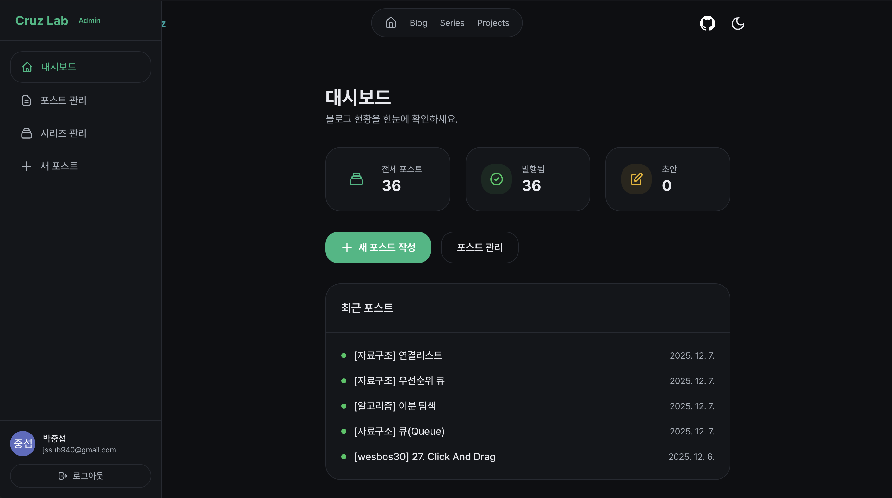
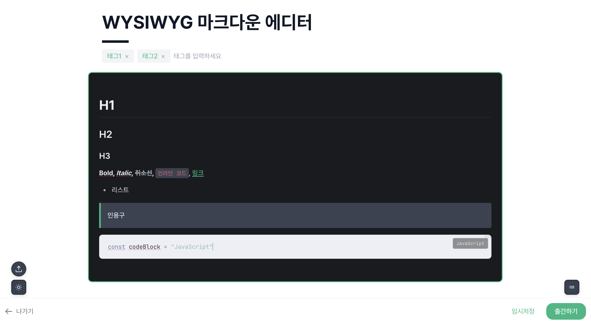
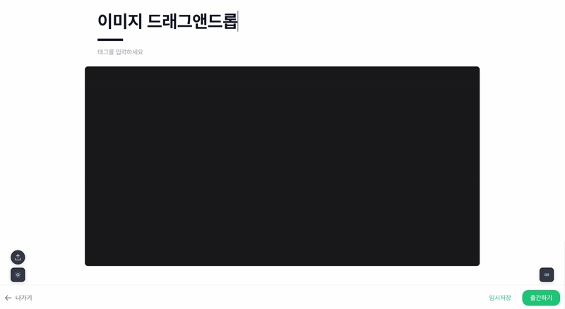
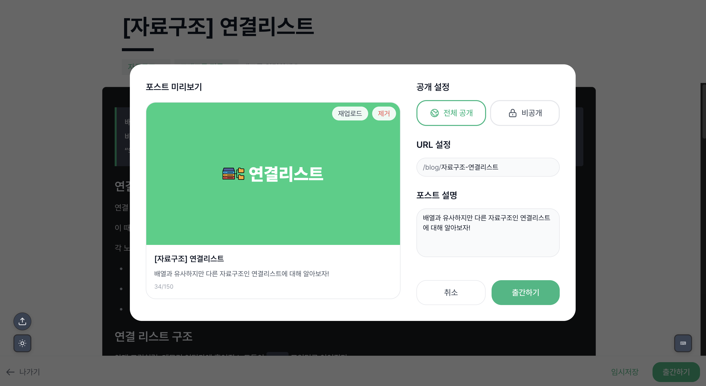

> Cruz Lab은 포트폴리오 사이트이기도 하지만, 내 글을 실제로 운영하는 블로그이기도 하다.  
> 처음 출발점은 거창하지 않았다. 정적 블로그를 계속 쓰다 보니 글 하나 올리는 일 자체가 귀찮아졌고, 그 병목을 직접 줄여보고 싶었다.

기존 블로그는 글을 쓰려면 VS Code를 열고, 마크다운 파일을 만들고, 이미지를 옮기고, 커밋하고, 반영까지 기다려야 했다.

작업 하나하나는 어렵지 않았다.  
문제는 이 흐름이 글 쓰는 일 자체를 자꾸 미루게 만든다는 점이었다.

그래서 이번에는 공개 페이지보다 먼저 **운영 흐름**부터 다시 보게 됐다.

## 1. 브라우저에서 바로 쓰는 흐름부터 만들었다

가장 먼저 손본 건 관리자 페이지였다.

이번엔 단순한 `textarea` 대신, 마크다운을 그대로 쓰면서도 브라우저 안에서 바로 다룰 수 있는 편집기가 필요했다.  
그래서 에디터는 **CodeMirror 기반**으로 다시 구성했다.

여기서 중요했던 건 "예쁘게 보이는 에디터"보다 **실제로 계속 쓸 수 있는 흐름**이었다.

- 작성 중 내용은 local draft와 autosave로 바로 보존하고
- 필요하면 markdown import/export로 외부에서 가져오거나 내보낼 수 있게 만들고
- 포스트 목록에서는 발행본과 로컬 초안을 구분해서 다시 이어서 작업할 수 있게 했다

결국 목표는 하나였다.  
브라우저만 열면 바로 이어서 쓸 수 있는 상태를 만드는 것.

## 2. 이미지 업로드와 출간을 같은 흐름 안에 넣었다

에디터가 생겨도 이미지 처리와 출간이 따로 놀면 결국 다시 번거로워진다.

그래서 이미지 업로드는 **Firebase Storage**에 바로 붙였다.  
에디터에 이미지를 드래그 앤 드롭하면 업로드 후 본문에 마크다운 링크가 바로 들어가도록 만들었다.

출간은 **Firestore direct publish** 기준으로 정리했다.  
지금은 출간 버튼을 누르면 Firestore에 바로 반영되고, 공개 블로그도 그 데이터를 기준으로 바로 읽는다.

대신 markdown 원문은 버리지 않았다.  
GitHub에는 백업 형태로 같이 남겨서, 브라우저 중심 CMS를 유지하면서도 원문 파일을 따로 보관할 수 있게 했다.

이 구조로 바꾸고 나니 "글을 쓰는 곳", "이미지를 올리는 곳", "실제 공개되는 곳"이 따로 분리돼 있던 불편이 많이 줄었다.

## 3. 공개 페이지와 관리자 경험을 한 프로젝트 안에서 같이 풀었다

공개 블로그는 빠르게 읽혀야 하고, 관리자 화면은 편하게 조작돼야 한다.  
이 둘을 같은 방식으로 풀면 한쪽이 손해를 보기 쉽다.

그래서 사이트 구조는 **Astro + React** 조합으로 가져갔다.

- 공개 페이지는 Astro 기반으로 구성해 블로그와 프로젝트 페이지를 가볍게 유지하고
- 관리자 화면과 편집 흐름은 React로 만들어 상태 처리와 인터랙션을 다루기 쉽게 했다

즉, 정적인 읽기 화면과 동적인 관리 화면을 아예 같은 문제로 보지 않았다.

여기에 프론트 인터랙션도 조금씩 더했다.  
스크롤 진행률, 카드 반응, 버튼 인터랙션 같은 요소를 넣긴 했지만, 이 프로젝트에서 더 중요한 건 그런 효과보다도 **실제로 운영 가능한 흐름을 먼저 만든 것**이었다.

## 마무리

Cruz Lab에서 제일 크게 바뀐 건 화면보다 운영 방식이었다.

예전에는 글 하나 올리는 일이 개발 작업에 가까웠다.  
지금은 브라우저에서 쓰고, 이미지를 올리고, 바로 반영까지 확인하는 흐름이 한 곳에 모여 있다.

포트폴리오 사이트를 만든 셈이기도 하지만, 내 기준에서는 그보다 **내 블로그를 계속 굴릴 수 있게 만든 작업**에 더 가깝다.
