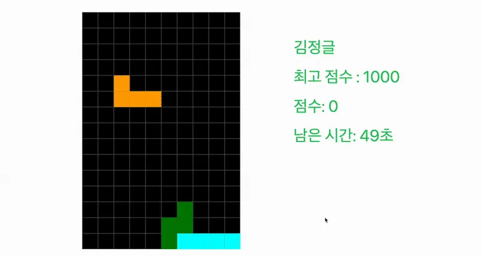
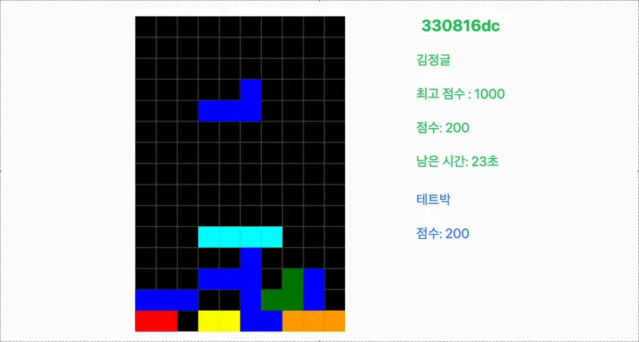

> 해커톤에서는 무언가를 많이 만드는 것보다, 짧은 시간 안에 어디까지 구현할지를 빨리 정하는 일이 더 중요했다.  
> Jungle Tetris도 그랬다. 3박 4일 안에 멀티 대전 테트리스를 만들려면 DOM 대신 Canvas를 택하고, 화면 전체 공유 대신 점수 동기화에 집중해야 했다.

## 1. DOM으로 테트리스를 만들면 안 되는 이유

### 배경 및 문제 정의

처음엔 단순하게 접근했다. 테트리스 판이 10x20 크기이니, `div` 200개를 배치하고 각 셀의 배경색만 바꾸면 된다고 생각했다.

```html
<div class="grid">
  <div class="cell filled"></div>
  <div class="cell empty"></div>
  <!-- ...200개의 div... -->
</div>
```

하지만 블록을 움직이는 순간 성능 문제가 바로 드러났다.

블록이 한 칸 이동할 때마다 수십 개의 `div` 스타일이 바뀌고, 브라우저는 레이아웃 재계산과 다시 그리기를 반복했다.

결국 여기서는 DOM으로 계속 가는 게 아니라, 렌더링 방식을 바꿔야 했다.

### 해결: Canvas API로 전환

그래서 브라우저의 DOM 조작 대신 **Canvas API**로 직접 그리기로 바꿨다.

Canvas는 화면을 매번 지우고 다시 그리는 방식이기 때문에, 200개의 DOM 요소를 관리하는 오버헤드 없이 훨씬 단순하게 렌더링할 수 있다.

```javascript
function render() {
  clear();
  drawGrid();
  drawFixedBlocks();
  if (game.current) drawCurrentBlock();
}

function clear() {
  game.ctx.clearRect(0, 0, COLS, ROWS);
}
```

또한 `setInterval` 대신 `requestAnimationFrame`을 사용해 브라우저 주사율에 맞춘 게임 루프를 구성했다.

```javascript
function animate(now = 0) {
  render();
  requestAnimationFrame(animate);
}
```



이 전환만으로도 화면이 훨씬 매끄러워졌다.  
해커톤에서 가장 먼저 맞닥뜨린 병목은 기능 부족보다 렌더링 방식 자체에 있었다.

## 2. 처음 써보는 Socket.IO로 실시간 대전 붙이기

### 배경 및 위기

멀티 테트리스의 핵심은 실시간성이다.

문제는 나도, 백엔드 팀원도 소켓 관련 기술을 써본 적이 없었다는 점이었다.  
남은 시간은 3일. 게임 로직만으로도 빠듯한데, 생소한 통신 구조까지 같이 익혀야 했다.

실제로 중간 발표 때도 "이거 최종 발표 때까지 러너블하게 구현할 수 있겠냐"는 말을 들을 정도로 시간이 빡빡했다.

### 해결: 화면 전체 공유 대신 점수 동기화에 집중

그래서 범위를 줄였다.

상대방의 게임 화면을 통째로 동기화하는 대신, **점수 데이터만 실시간으로 동기화**하는 구조로 갔다.

```python
@socketio.on('game:score_update')
def handle_score_update(data):
    socketio.emit('game:score_update', {
        'players': updated_players_list
    }, room=room_id)
```

```javascript
socket.emit('game:score_update', { room_id, score: currentScore });

socket.on('game:score_update', (data) => {
  updateOpponentScoreUI(data.players);
});
```

상대방의 전체 화면은 보이지 않더라도, 옆에서 점수가 즉시 갱신되는 것만으로도 경쟁감은 충분히 생겼다.



짧은 해커톤에서는 무엇을 구현할지보다, 무엇을 버릴지가 더 중요했다.  
이 프로젝트에선 그 판단이 꽤 잘 맞았다.

## 3. 끝내고 나서야 더 명확해진 한계

발표 때 가장 많이 들은 말도 사실 이 부분이었다.

점수만 오르는 것보다 상대방 화면이 같이 보였으면 훨씬 더 긴장감 있었을 거라는 피드백이다.

우리도 그걸 모르진 않았다.  
다만 해커톤 당시에는 "프레임마다 전체 상태를 보내면 감당할 수 있을까?"라는 걱정이 더 컸다.

그래서 점수 동기화까지만 가는 쪽을 택했다.

지금 다시 보면 이건 절반짜리 멀티플레이였다.  
그래도 해커톤 MVP로는 맞는 선택이었다고 본다.

## 마무리

Jungle Tetris에서는 Canvas 전환과 점수 동기화만으로도 충분히 게임이 됐다.

다만 그 선택이 어디까지 유효한지,  
멀티플레이를 더 게임답게 만들려면 무엇이 더 필요했는지는 분명히 남았다.

그 이야기는 결국 다음 글로 이어진다.
