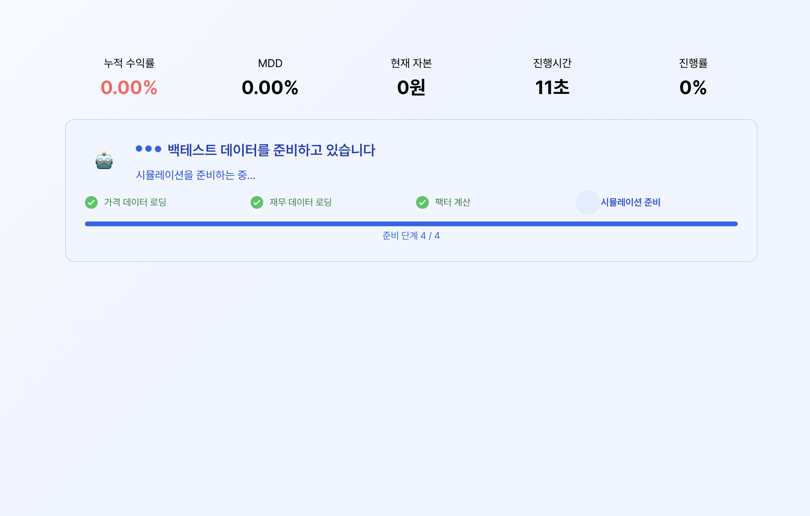
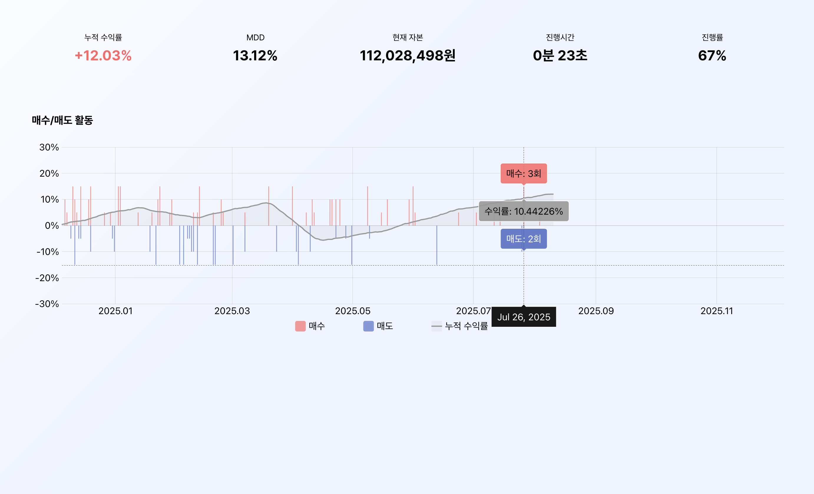

> Stock Lab에서 가장 먼저 부딪힌 문제는 계산 자체보다 기다리는 시간이 길다는 점이었다.  
> 백테스트 하나를 돌리면 준비부터 차트 렌더링까지 20초 넘게 걸렸고, 그 시간 동안 화면은 거의 멈춰 있었다.

## 1. 30초의 기다림을 관전의 흐름으로 바꾸기 (WebSocket)

### 배경 및 문제 정의

우리 서비스의 핵심 기능은 백테스트(Backtest) 연산이다. 유저가 투자 전략을 세우고 "시뮬레이션 시작"을 누르면, 서버는 과거 수년 치 주가 데이터를 분석하여 수익률을 계산한다.

데이터 양이 방대하다 보니 시뮬레이션을 준비하는 데만 평균 13초, 차트 렌더링까지 포함하면 25~30초가 걸렸다.

문제는 계산 시간이 길다는 사실 자체보다, 그 시간 동안 사용자가 화면에서 확인할 수 있는 게 거의 없었다는 점이었다.

### 초기 접근

초기 구현은 단순했다.

시뮬레이션 준비 시간 동안에는 로딩 스피너를 띄워두고,

시뮬레이션 연산이 시작되면 `React Query`의 폴링(Polling) 기능으로 2초마다 서버를 찔러보며 차트 데이터를 받아왔다.

```typescript
useQuery({
  queryKey: ['backtest-status', id],
  queryFn: checkStatus,
  refetchInterval: 2000,
});
```

하지만 이 방식에는 분명한 문제가 있었다.

1. 준비 시간 동안 화면 변화가 거의 없어 시스템이 멈춘 것처럼 보였다.
2. 2초마다 전체 누적 데이터를 다시 받아오다 보니 전송량과 갱신 지연이 같이 커졌다.

그래서 서버가 하는 일을 더 잘 보여주고, 클라이언트가 같은 데이터를 반복해서 처리하지 않도록 WebSocket으로 방향을 바꿨다.

### 해결 1: 시뮬레이션 준비 단계를 나눠서 보여주기

서버가 실제로 일하고 있다는 걸 보여주기 위해 내부 상태를 4단계로 나눴다.

`가격 데이터 로딩` → `재무 데이터 로딩` → `팩터 계산` → `시뮬레이션 준비`



```typescript
export interface PreparationMessage {
  type: "preparation";
  stage: "LOADING_PRICE_DATA" | "LOADING_FINANCIAL_DATA" | "CALCULATING_FACTORS" | "PREPARING_SIMULATION";
  stage_number: number;
  total_stages: number;
  message: string;
}
```

서버에서 단계가 바뀔 때마다 메시지를 보내고, 클라이언트는 이를 한국어 라벨로 매핑해 현재 상태를 바로 보여줬다.

이렇게 바꾸고 나니 단순한 로딩보다 훨씬 납득 가능한 화면이 됐다.  
사용자는 "멈췄다"보다 "지금 이 단계구나"라고 받아들이게 됐다.

### 해결 2: 증분 데이터만 보내기

가장 크게 바뀐 건 데이터 전송 방식이었다.

기존에는 폴링으로 2초마다 전체 누적 차트 데이터를 받아와 매번 전체 차트를 다시 그렸다.

WebSocket으로 바꾼 뒤에는 "방금 계산된 1일치 결과"만 보내고, 클라이언트에서는 새 데이터만 기존 배열에 붙였다.

```typescript
ws.onmessage = (event) => {
  const message = JSON.parse(event.data);

  if (message.type === "progress") {
    const newDataPoint = {
      date: message.date,
      portfolioValue: message.portfolio_value,
    };

    setChartData((prev) => [...prev, newDataPoint]);
    setProgress(message.progress_percent);
  }
};
```



결과적으로 불필요한 중복 전송이 줄었고, 화면도 더 자주 자연스럽게 갱신됐다.

여기서 중요한 건 "실시간"이라는 말보다, **기다리는 시간을 어떻게 덜 답답하게 바꾸느냐**였다.

## 2. AI 챗봇 응답도 한 번에 떨어지지 않게 만들기 (SSE)

### 배경 및 문제 정의

Stock Lab에는 주식 용어나 전략을 설명해주는 AI 챗봇이 있다.

문제는 LLM 응답에 5~10초 정도 걸린다는 점이었다.

초기에는 일반 HTTP `POST` 요청으로 구현해서, AI가 답변을 다 만들 때까지 사용자는 빈 말풍선만 보고 있어야 했다.  
답변은 마지막에 한 번에 떨어졌다.

이 상태로는 대화라기보다 결과 조회에 가까웠다.

### 해결: SSE 기반 스트리밍

그래서 서버에서 연결을 끊지 않고 토큰 단위로 내려보내는 SSE를 붙였다.

처음에는 답변을 다 받은 뒤 UI에서 한 글자씩 늦게 뿌리는 것도 생각했지만, 그건 체감만 늦출 뿐 근본 해결은 아니었다.

응답 자체가 조금씩 도착해야 했다.

### 딜레마: EventSource vs Fetch API

구현 중 가장 먼저 고민한 건 클라이언트에서 이 스트림을 어떻게 받을지였다.

처음에는 브라우저 기본 API인 `EventSource`를 선택했다.  
사용법이 간단하고 자동 재연결도 있으니까 그쪽이 더 쉬워 보였다.

```typescript
const url = new URL("/api/v1/chat/stream", baseUrl);
url.searchParams.set("message", message);

const eventSource = new EventSource(url.toString());
```

첫 글자가 빨리 보인다는 점에서는 분명 효과가 있었다.

하지만 구현을 다시 보면서 한계도 분명해졌다.

### EventSource가 편해 보여도 정답은 아니었다

`EventSource`는 GET 요청만 지원한다.

즉, 질문 내용을 URL 쿼리 파라미터에 실어 보내야 한다.

```typescript
const url = new URL("/api/v1/chat/stream", baseUrl);
url.searchParams.set("sessionId", sessionId);
url.searchParams.set("message", message);
url.searchParams.set("clientType", "assistant");
```

이 방식에는 바로 문제가 생긴다.

1. 사용자 질문이 URL에 노출된다.
2. URL 길이 제한 때문에 긴 프롬프트는 취약하다.
3. 실제로 널리 쓰는 방식과도 거리가 있다.

OpenAI나 Claude 쪽 스트리밍도 결국은 POST 요청 본문에 내용을 담고, 응답을 스트림으로 읽는 방식이다.

SSE를 쓴다는 게 곧 `EventSource`를 써야 한다는 뜻은 아니었다.

```javascript
const response = await fetch('https://api.openai.com/v1/chat/completions', {
  method: 'POST',
  headers: {
    'Content-Type': 'application/json',
    'Authorization': `Bearer ${API_KEY}`
  },
  body: JSON.stringify({
    model: 'gpt-4',
    messages: [{ role: 'user', content: '안녕하세요' }],
    stream: true
  })
});
```

결국 이 부분은 **동작은 했지만, 프로덕션 기준으로는 아직 거칠었다**고 보는 편이 맞다.

그리고 백테스트 쪽과 달리 챗봇은 일회성 요청이기 때문에, 자동 재연결보다 중단과 재시도가 더 중요한 문제였다.

## 3. 왜 백테스트는 WebSocket으로 남겼는가

프로젝트를 다시 보면서 또 하나 생각한 건 이 부분이었다.

백테스트 쪽은 실제로 클라이언트가 서버에 계속 뭔가를 보내는 구조는 아니었다.  
기술적으로만 보면 SSE로도 가능했을 수 있다.

그런데 당시에는

1. 백엔드 쪽에 이미 WebSocket 엔드포인트가 잡혀 있었고
2. 이후 시뮬레이션 중단 같은 양방향 기능으로 확장할 여지도 있었다

는 점 때문에 WebSocket이 더 자연스러운 선택이었다.

즉, 가볍다는 이유만으로 SSE를 고르기보다 앞으로 필요한 통신 방향까지 같이 본 셈이다.

## 마무리

Stock Lab에서 중요했던 건 WebSocket과 SSE를 둘 다 붙였다는 사실 자체가 아니었다.

더 먼저 풀어야 했던 문제는,  
**오래 걸리는 작업을 사용자가 어떻게 견딜 수 있게 만들 것인가**였다.

백테스트에서는 기다리는 흐름을 보여줬고,  
챗봇에서는 응답이 한 번에 떨어지지 않게 바꿨다.

결국 이 글에서 남는 건 기술 이름보다,  
**긴 대기 시간을 어떻게 화면 경험으로 바꿨는가**에 더 가깝다.
