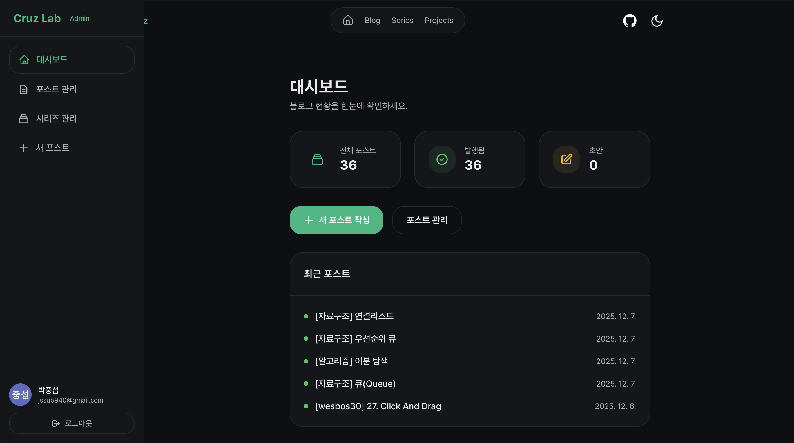
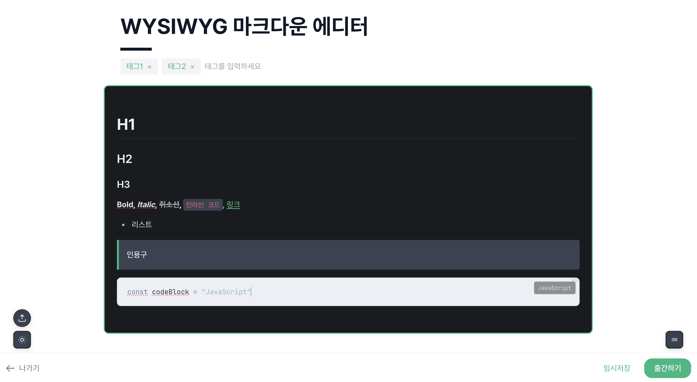
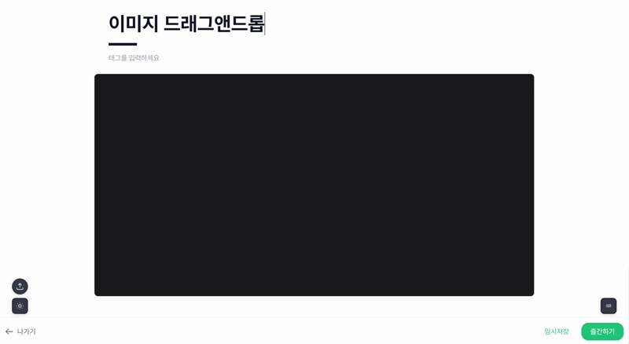

# Cruz Lab: 정적 블로그에 생명을 불어넣기

> Cruz Lab은 크래프톤 정글 수료 후 포트폴리오를 준비하면서 시작된 프로젝트다. 포트폴리오를 웹으로 배포하는 김에 기존에 Next.js로 개발하여 운영하던 개인 블로그([amgona-blog](https://amgona-blog.vercel.app/dev))를 디벨롭하여 통합하기로 결정했다.
> 
> 단순히 정보를 나열하는 정적인 사이트보다는, 
> - 방문자가 상호작용할 수 있는 인터랙티브한 요소들을 넣어 ‘살아있는’ 느낌을 주고싶었으며,
> - 단순한 정보 전달을 넘어 **"내가 만든 공간에서 직접 글을 쓰고 관리하는"** 경험을 만들고 싶었다.

## 1. "git push" 없이 글을 쓰고 싶다 (CMS 구축)

### 배경 및 문제 정의

기존 개인 블로그는 전형적인 정적 사이트 SSG(Static Site Generation) 방식으로, 글을 쓰려면 VS Code를 열고 마크다운 파일을 생성해야 했다.

이미지라도 하나 넣으려면 파일을 로컬 폴더에 옮기고 경로를 맞춰주는 번거로운 작업이 필요했다.

이런 불편함은 결국 기록을 게을리하게 만드는 원인이 되었다.

**"웹에서 노션(Notion)처럼 바로 글을 쓰고 배포할 순 없을까?"**

### 해결: 나만의 WYSIWYG 에디터 구현

이를 해결하기 위해 사이트 내에 **Admin 페이지**를 직접 구축하기로 했다.



핵심은 **에디터**였다. 

#### *WYSIWYG 에디터*

단순히 텍스트만 입력하는 `textarea`가 아니라, 작성과 동시에 결과를 확인할 수 있는 **WYSIWYG(What You See Is What You Get)** 환경을 구현하고자 했다.

여러 라이브러리를 검토한 끝에 **Milkdown**을 선택했다.

Milkdown은 Headless UI 기반이라 확장이 자유로웠고, 무엇보다 마크다운 문법을 실시간으로 프리뷰해주는 기능이 강력했다.



#### *이미지 처리*

여기에 **Firebase Storage**를 연동하여, 이미지를 에디터에 드래그 앤 드롭하면 즉시 업로드되고 마크다운 링크로 변환되는 기능을 추가했다.



#### *즉시 배포*

작성 완료 후 ‘출간하기’ 버튼을 누르면 Firestore에 데이터가 저장되고 사이트에 즉시 반영된다.


결과적으로 VS Code 없이도 언제 어디서든 브라우저만 켜면 기술 블로그를 작성할 수 있는 환경을 완성했다.

---

## 2. 정적 성능과 동적 기능의 공존 (Astro Island)

### 딜레마

블로그의 생명은 **속도**와 **SEO**다. 따라서 기본적으로는 정적 사이트(Static)여야 한다.

하지만 Admin 페이지나 댓글, 조회수 같은 기능은 **동적(Dynamic)** 이어야 한다.

Next.js로도 가능하지만, 정적 콘텐츠 위주의 사이트에서는 **Astro**가 더 가볍고 효율적이라 판단했다.

### 해결: Island Architecture 활용

Astro의 **Island Architecture**를 통해 이 문제를 우아하게 해결했다.

*   **블로그 포스트, 메인 화면**: 빌드 타임에 정적 HTML로 생성하여 빠른 로딩 속도 보장.
*   **Admin 페이지, 인터랙티브 컴포넌트**: React 컴포넌트로 구현하고 `client:only` 혹은 `client:visible` 지시어를 통해 필요한 부분만 클라이언트에서 하이드레이션(Hydration).

```astro
<!-- 정적 페이지 안에 React 앱(Admin)을 섬(Island)처럼 띄움 -->
<AdminDashboard client:only="react" />
```

덕분에 블로그의 빠른 속도를 유지하면서도, 관리자 기능은 완전한 SPA(Single Page Application)처럼 부드럽게 동작하도록 구현할 수 있었다.

---

## 3. "Lab"다운 시각적 재미 (Framer Motion)

단순히 글만 있는 딱딱한 사이트가 되지 않길 바랐다.

'Lab(실험실)'이라는 이름에 걸맞게 **Framer Motion**을 활용하여 총 12가지 이상의 인터랙티브 컴포넌트를 직접 구현하고 실험했다.

### 주요 인터랙션 구현

1.  **3D Tilt & Magnetic Effect**:
    메인 화면의 프로필 카드에는 마우스 위치를 계산(`useMotionValue`)하여 3D로 기울어지는 Tilt 효과를, 주요 버튼에는 커서가 가까이 가면 자석처럼 달라붙는 Magnetic 효과를 적용했다.
2.  **마이크로 인터랙션 (Micro-interactions)**:
    *   **Glow Card**: 마우스 커서를 따라 카드의 테두리와 배경에 은은한 조명이 따라다니는 효과
    *   **Ripple Button**: 버튼 클릭 시 물결이 퍼져나가는 Material Design 스타일의 효과
    *   **Cursor Follower**: 링크나 버튼 위에서는 커지고 클릭 시 반응하는 커스텀 커서
3.  **데이터 시각화**:

    *   **Scroll Progress**: 포스트를 읽는 동안 상단에 진행률을 실시간으로 표시

<!-- TODO: 메인 화면 3D Tilt 효과 혹은 Glow Card 인터랙션 스크린샷/GIF -->

이러한 요소들은 단순히 라이브러리를 가져다 쓰는 데 그치지 않고, `useMotionValue`와 `useTransform`을 적극 활용하여 마우스 이벤트가 발생할 때마다 React 리렌더링을 유발하지 않고 DOM을 직접 조작하도록 최적화했다. 

덕분에 화려한 효과 속에서도 60fps의 부드러운 성능을 유지할 수 있었다.

---

## 마무리

**Cruz Lab**을 개발하며 프레임워크의 선정부터 배포 파이프라인까지 웹 개발의 전 과정을 주도적으로 경험할 수 있었다.
무엇보다 가장 큰 수확은 **"나의 불편함을 기술로 직접 해결했다"** 는 점이다.

이제 나는 더 이상 `git push`를 하지 않고도 포스트를 수정하고 배포할 수 있다!😎