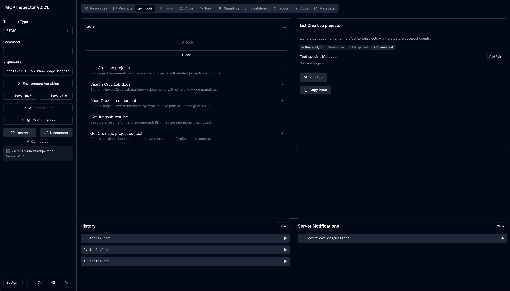
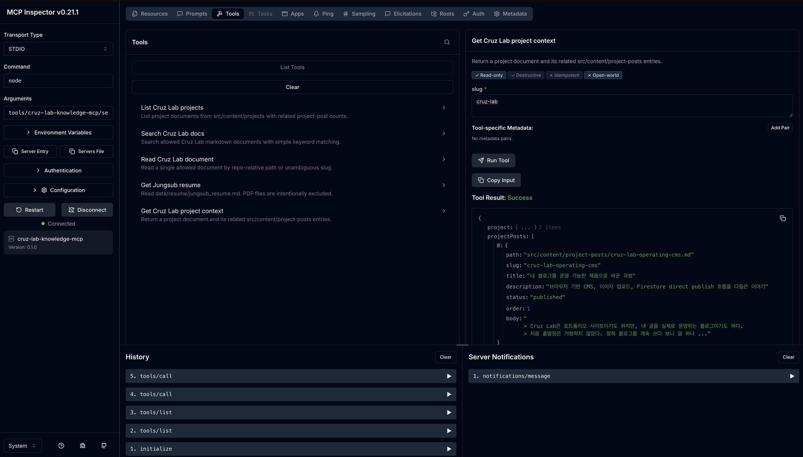

MCP에 대해 다룬 [MCP를 문서로만 보면 놓치는 것들](/blog/why-everyone-talks-about-mcp) 포스트에서는 Stock Lab에서 Figma MCP를 써봤던 경험과 작은 read-only 서버 실험을 바탕으로, MCP의 tool, resource, prompt 경계를 정리했다.

이번에는 그 작은 read-only 서버 실험을 조금 더 자세히 적어보려 한다.
MCP 서버를 직접 만들고, Cruz Lab에 쌓인 문서들을 에이전트가 읽을 수 있게 연결해본 과정이다.

Cruz Lab은 이미 글을 쓰고, 이미지를 올리고, Firestore에 바로 반영하는 흐름까지 갖고 있었다.
그런데 정작 내가 AI 에이전트에게 "내 Cruz Lab 프로젝트 맥락 좀 찾아봐"라고 말하려면 여전히 파일을 직접 붙여넣거나, 경로를 하나씩 알려줘야 했다.

그래서 기존 문서를 읽는 작은 MCP 서버를 만들어봤다.

## 범위부터 작게 잘랐다

처음부터 검색 시스템을 만들 생각은 없었다.

이름은 `cruz-lab-knowledge-mcp`.
형태는 로컬 `stdio` MCP 서버.
역할은 read-only 문서 조회.

여기까지만 잡았다.

반대로 뺀 것도 많다.

- 벡터 검색 없음
- 임베딩 없음
- 웹 UI 없음
- Firebase/Firestore 연동 없음
- 원격 MCP 서버 없음
- 인증 없음
- 배포 없음

내가 보고 싶었던 건 기능보다 경계였다.
내 문서를 어떤 단위로 에이전트에게 열어줄지 직접 나눠보고 싶었다.

그래서 서버도 repo 안의 `tools/cruz-lab-knowledge-mcp/` 아래에 뒀다.

```text
tools/cruz-lab-knowledge-mcp/
  README.md
  TEST_RESULT.md
  server.mjs
```

`server.mjs` 하나로 충분했다.
지금 단계에서 TypeScript 빌드나 별도 패키지 구조까지 가져가면, 실험보다 관리할 게 더 많아질 것 같았다.

## 무엇을 읽게 할지 정했다

읽기 대상은 네 군데로 제한했다.

```text
src/content/projects
data/final-posts
data/resume
```

이 세 경로면 지금 필요한 문맥은 대체로 들어온다.

- 프로젝트 메타와 프로젝트별 포스트
- 아직 출간 전인 기술 글 초안
- 이력서 문서

반대로 읽으면 안 되는 것도 정했다.

Firebase admin key처럼 민감한 JSON 파일은 제외했다.
PDF, 이미지, 바이너리 파일도 제외했다.
`.git`, `node_modules`, `dist`, `.astro`, `.vercel` 같은 디렉토리도 건드리지 않게 했다.

문서 조회 서버라고 해도, 그냥 repo 전체를 열어두고 싶지는 않았다.
MCP는 연결을 쉽게 만들어주지만, 그래서 더 먼저 봐야 하는 건 "어디까지 읽게 할 건가"였다.

## tool, resource, prompt를 이렇게 나눴다

[MCP를 문서로만 보면 놓치는 것들](/blog/why-everyone-talks-about-mcp)에서는 이 구분을 개념 쪽에서 다뤘다.
이번에는 Cruz Lab 문서에 맞춰 tool, resource, prompt를 어떻게 나눴는지 본다.

먼저 tools는 입력을 받아 무언가를 찾아오거나 묶어주는 쪽으로 뒀다.

```text
list_projects
search_docs
read_doc
get_resume
get_project_context
```

`list_projects`는 프로젝트 목록을 돌려준다.
`search_docs`는 허용된 문서 안에서 키워드를 찾는다.
`read_doc`은 특정 문서를 읽는다.
`get_resume`은 이력서 문서를 가져온다.
`get_project_context`는 프로젝트 메타 문서와 관련 project post를 한 번에 묶어준다.

특히 `get_project_context`는 생각보다 유용했다.
예를 들어 `cruz-lab`을 넣으면 `src/content/projects/cruz-lab/project.md`와 `cruz-lab-operating-cms`, `cruz-lab-v2-offline-accessibility` 같은 포스트가 같이 묶인다.
후속 글을 쓰거나 면접 답변 맥락을 잡을 때, 에이전트가 여기저기 파일을 따로 찾지 않아도 된다.

resources는 URI로 바로 읽을 수 있는 문맥으로 뒀다.

```text
cruzlab://projects
cruzlab://resume
cruzlab://project/{slug}
```

프로젝트 목록, 이력서, 특정 프로젝트 컨텍스트처럼 "읽기 대상"으로 보기 쉬운 것들이다.

prompts는 반복 작업의 출발점으로 잡았다.

```text
interview_questions
blog_post_context
```

예를 들어 `interview_questions`는 특정 프로젝트를 기준으로 면접 질문을 만들 때 쓸 프롬프트 템플릿이다.
`blog_post_context`는 후속 글을 쓰기 전에 어떤 문서를 봐야 하는지 정리하는 템플릿이다.

재밌었던 건 클라이언트마다 보이는 방식이 조금 달랐다는 점이다.
Codex에서는 tools와 resources는 바로 보였다.
반면 prompts는 직접 호출 표면에서 잘 드러나지 않아 MCP SDK 클라이언트로 따로 확인했다.

스펙으로는 같은 서버 안에 있어도, 실제 사용하는 화면에서는 조금씩 다르게 보일 수 있다는 걸 여기서 체감했다.

## 읽기 서버라도 경계는 필요했다

이 서버는 파일을 쓰지 않는다.
그래도 경계가 필요했다.

가장 먼저 막은 건 허용 디렉토리 밖 접근이었다.
예를 들어 `read_doc`에 이런 값을 넣으면 차단돼야 한다.

```text
../package.json
```

테스트에서는 이 경로가 정상적으로 막혔다.

```text
Document path is outside the allowed read roots: ../package.json
```

이건 대단한 보안 기능은 아니다.
그냥 최소한의 선이다.

하지만 작은 로컬 실험에서도 이 선은 필요했다.
문서를 읽는 서버라고 해서 repo 안의 모든 파일을 읽어도 되는 건 아니다.

## Codex와 Inspector에서 확인했다

서버를 만들고 나서 바로 궁금했던 건 "진짜 MCP 클라이언트에서 보이나?"였다.

먼저 Codex 전역 MCP 설정에 서버를 등록했다.
새 Codex 세션에서 `cruz-lab-knowledge` 서버가 보였고, tools와 resources도 조회됐다.

그다음 MCP Inspector를 띄웠다.



Inspector Tools 탭에서 `list_projects`, `search_docs`, `read_doc`, `get_resume`, `get_project_context`가 보였다.
문서에서 보던 tool 목록이 실제 화면에 뜨니, 내가 만든 서버가 클라이언트에 어떤 이름으로 노출되는지 바로 확인할 수 있었다.

`get_project_context`도 직접 실행해봤다.



`cruz-lab`을 넣었을 때 프로젝트 메타 문서와 관련 project post가 같이 반환됐다.
내가 원했던 흐름도 딱 이거였다.

에이전트에게 "Cruz Lab 맥락을 보고 후속 글 방향 잡아줘"라고 했을 때, 프로젝트 설명과 이전 글을 같이 읽을 수 있어야 했다.

Resources도 SDK와 Inspector proxy 경유로는 정상 확인했다.
다만 Inspector GUI의 Resources 탭은 상태 표시가 엇갈려 보이는 화면이 있어, 포스팅용 스크린샷에서는 제외했다.
괜히 애매한 화면을 넣고 설명을 늘리는 것보다 tools 실행 결과만 보여주는 편이 나았다.

## 만들고 나서 남은 판단

여기서 제일 조심한 건 크기를 키우지 않는 일이었다.

조금만 욕심내면 바로 다음 단계가 떠오른다.

- 검색 랭킹을 더 좋게 만들까?
- 임베딩을 붙일까?
- 원격 서버로 띄울까?
- 인증을 붙일까?
- 블로그 관리자 화면에서 MCP 상태를 보여줄까?

지금은 전부 하지 않는 쪽이 맞았다.

이 서버는 운영 제품이 아니다.
내가 확인하려던 건 MCP의 경계였다.
Cruz Lab은 이미 CMS와 읽기 경험 개선을 다룬 프로젝트였고, 여기에 또 큰 시스템을 얹으면 초점이 흐려질 것 같았다.

확인한 건 더 좁다.

- 에이전트가 내 문서를 읽게 하려면 어떤 경로를 열어야 하는지
- 어떤 기능은 tool로 두고, 어떤 문맥은 resource로 두는 게 자연스러운지
- prompt template은 클라이언트에 따라 어떻게 보일 수 있는지
- read-only 서버라도 읽기 범위는 막아야 한다는 점

지금 단계에서는 여기까지면 됐다.

## 마무리

이번에 만든 서버는 CMS의 다음 기능이라기보다, 프로젝트 안에 쌓인 문서를 다루는 방식을 하나 더 만든 것에 가깝다.

기존에는 에이전트에게 맥락을 주려면 파일을 직접 붙이거나 경로를 하나씩 알려줘야 했다.
이제는 최소한 프로젝트 설명, 후속 글, 초안, 이력서 문서까지는 정해진 경계 안에서 읽게 할 수 있다.

물론 이 서버가 블로그를 대신 운영해주지는 않는다.
검색 품질이 뛰어난 것도 아니고, 운영용 권한 모델을 갖춘 것도 아니다.

그래도 Cruz Lab이라는 프로젝트에는 맞는 크기였다.
새 시스템을 크게 얹는 대신, 이미 있는 문서를 에이전트가 읽을 수 있는 작은 입구로 묶었다.