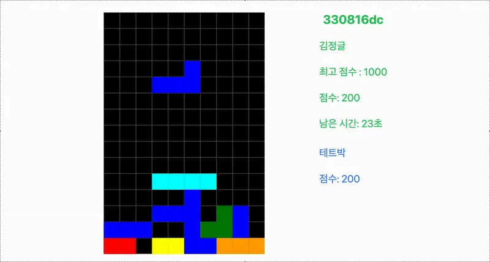

# Jungle Tetris: Canvas API로 3일 만에 멀티 테트리스 만들기

> 크래프톤 정글 0주차에 진행된(입소하자마자 바로...😂) **3박 4일 해커톤**. 주제는 자유였다.
> 
> 우리 팀은 "단순한 테트리스는 재미없으니, **실시간으로 서로 공격하는 멀티 대전 테트리스**를 만들어보자!"는 목표를 세웠다.
>
> 게임 개발 경험이 전무한 상태에서 맨땅에 헤딩하며 게임 로직부터 멀티플레이 서버까지 직접 구현했던 치열한 72시간의 기록을 공유해보고자 한다.

## 1. DOM으로 테트리스를 만들면 안 되는 이유

### 배경 및 문제 정의

처음엔 단순하게 접근했다. 테트리스 판이 10x20 크기이니, `div` 200개를 배치하고 각 셀의 배경색만 바꾸면 테트리스가 될 것이라 생각했다.

```html
<!-- 상상 속의 테트리스 구조 -->
<div class="grid">
  <div class="cell filled"></div>
  <div class="cell empty"></div>
  <!-- ...200개의 div... -->
</div>
```

하지만 블록을 움직이는 순간 **심각한 성능 저하**가 발생했다.
블록이 한 칸 이동할 때마다 수십 개의 `div` 스타일을 갱신해야 했고, 브라우저는 레이아웃 재계산과 다시 그리기를 반복하느라 과부하가 걸렸다. 

뚝뚝 끊기는 화면을 보며 깨달았다. 

**"게임은 이렇게 만드는 게 아니구나."** 😱

### 해결: Canvas API로의 전환

우리는 브라우저의 렌더링 방식에 의존하는 DOM 조작을 버리고, **HTML5 Canvas API**를 도입하여 픽셀 단위로 직접 그리기로 결정했다.

Canvas는 화면을 매번 지우고 다시 그리는 방식을 사용하기 때문에, 200개의 DOM 요소를 관리하는 오버헤드 없이 고속 렌더링이 가능하다.

```javascript
// frontend/tetris.js

function render() {
  clear();              // 1. 화면 전체 지우기
  drawGrid();           // 2. 격자 그리기
  drawFixedBlocks();    // 3. 바닥에 쌓인 블록 그리기
  if (game.current) drawCurrentBlock(); // 4. 현재 조작 중인 블록 그리기
}

function clear() {
  game.ctx.clearRect(0, 0, COLS, ROWS);
}
```

또한, `setInterval` 대신 `requestAnimationFrame`을 사용하여 브라우저의 주사율(60Hz)에 최적화된 게임 루프를 구현했다.

```javascript
function animate(now = 0) {
  // ... 게임 로직 (시간 계산, 이동 처리) ...

  render(); // 매 프레임마다 화면 갱신
  requestAnimationFrame(animate); // 다음 프레임 요청
}
```


결과적으로 뚝뚝 끊기던 움직임이 사라지고, **부드러운 애니메이션**을 구현할 수 있었다. 😄

---

## 2. 처음 써보는 Socket.IO와 시간과의 싸움

### 배경 및 위기: "이거 마감까지 구현 가능해요?"

멀티 테트리스의 핵심은 **실시간성**이다. 실시간 게임을 만들려면 `Socket 통신`을 해야 한다는 것 정도만 알고 있었고, 
조사해보니 WebSocket 프로토콜을 지원하면서도 방(Room) 관리 등 편의 기능을 제공하는 Socket.IO 라이브러리를 도입하기로 했다.

문제는 **나와 백엔드 팀원 모두 Socket 관련 기술을 단 한 번도 써본 적이 없었다는 점**이었다..😅
주어진 시간은 단 3일. 게임 로직 구현만으로도 벅찬데, 생소한 라이브러리까지 공부해서 적용해야 했다.

실제로 중간 발표 때 코치님으로부터 **"이거 최종 발표 때까지 러너블(Runnable)하게 구현할 수 있겠어요?"** 라는 우려 섞인 피드백을 받기도 했다. 자칫하면 게임 로직만 만들고 멀티플레이는 보여주지도 못한 채 끝날 수도 있는 상황이었다.

### 해결: "선택과 집중"으로 핵심만 남기기

우리는 현실적인 목표를 세워야 했다. 
화려한 기능보다는 **"기간 내에 반드시 실행 가능한 결과물을 만드는 것"** 이 최우선이었다.

그래서 상대방의 게임 화면을 통째로 동기화하는 복잡한 방식 대신, **점수 데이터만 실시간으로 동기화**하는 방식으로 범위를 좁혔다. 

상대방의 화면이 보이지 않더라도, 내 화면 옆에서 실시간으로 갱신되는 상대방의 점수만으로도 충분히 경쟁심을 유발할 수 있을 것이라 판단했다.

```python
# backend/socket_events/handlers.py

@socketio.on('game:score_update')
def handle_score_update(data):
    # ... 인증 로직 ...
    
    # 방 내의 모든 플레이어에게 최신 점수 브로드캐스팅
    socketio.emit('game:score_update', {
        'players': updated_players_list
    }, room=room_id)
```

```javascript
// frontend/tetris-multi.html

// 내 점수 상승 시 이벤트 발송
socket.emit('game:score_update', { room_id, score: currentScore });

// 상대방 점수 업데이트 수신
socket.on('game:score_update', (data) => {
    updateOpponentScoreUI(data.players);
});
```

비록 화면 전체 공유는 포기했지만, 이 전략 덕분에 우리는 마감 시간 내에 안정적인 **실시간 대전 환경**을 구축할 수 있었다.

지연 시간(Latency)을 최소화하여, 내가 블록을 지우자마자 상대방 점수판이 갱신되는 즉각적인 반응성은 게임의 몰입도를 높이기에 충분했다.



---

## 3. 회고: 아쉬움과 배운 점

### 😅 "상대방 화면도 보여줄걸..."

프로젝트 발표 당시, 코치님으로부터 뼈있는 피드백을 받았다.

> *"점수만 오르는 건 좀 심심하네요. 상대방이 블록을 쌓는 화면이 실시간으로 보였다면 훨씬 박진감 넘쳤을 것 같습니다."*

사실 우리도 개발 중에 고민했던 부분이다. 하지만 **"매 프레임마다 200개의 셀 데이터를 전송하면 네트워크가 터지지 않을까?"** 하는 막연한 두려움 때문에 점수 동기화에 만족했었다.

### 더 나은 설계를 위한 고민: Deterministic Lockstep

프로젝트가 끝나고 리서치를 해보니, **Deterministic Lockstep**이라는 기법을 알게 되었다.

화면 전체 데이터(State)를 보내는 것이 아니라, **"오른쪽 키 입력", "회전 키 입력" 등의 입력 신호(Input)**만 전송하고, 각 클라이언트에서 시뮬레이션을 똑같이 수행하여 화면을 동기화하는 방식이다.

이 방식을 알았더라면 적은 데이터 전송량으로도 상대방의 화면을 완벽하게 재현할 수 있었을 것이다. 
역시 아는 만큼 보인다고, "실시간 네트워킹"의 세계가 생각보다 훨씬 깊다는 것을 깨달았다. 🥲

### 마무리

비록 3박 4일이라는 짧은 시간이었지만, 이동, 회전, 하드 드롭, 멀티플레이, 랭킹 시스템까지 핵심 기능을 **100% 구현한 MVP**를 완성했다는 점에서 큰 성취감을 느꼈다.

무엇보다 프론트엔드 개발자가 주로 다루는 DOM 조작을 넘어, **캔버스의 픽셀 좌표 계산, 충돌 감지 로직, 그리고 소켓 통신**과 같은 로우 레벨의 작업을 직접 구현해보며 개발자로서의 시야를 한 단계 넓힐 수 있었던 값진 경험이었다.

---