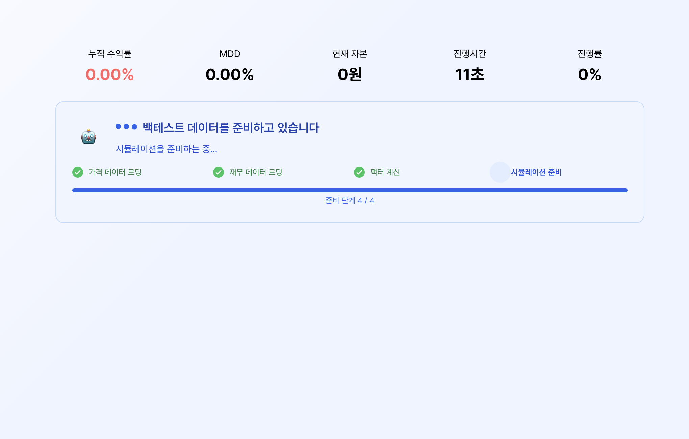
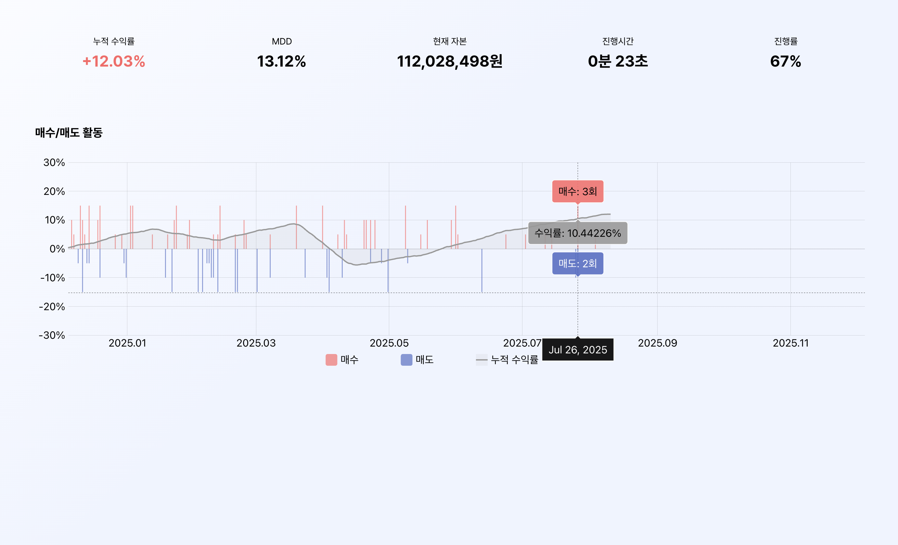

# Stock Lab: 실시간 퀀트 투자 플랫폼 개발기

> 크래프톤 정글에서의 마지막 5주, **"나만의 무기 갖기"** 파이널 프로젝트로 **Stock Lab**이라는 퀀트 투자 시뮬레이션 플랫폼을 개발하였다.
> 5주 동안 5명의 팀원과 함께 진행했으며, 프론트엔드를 맡아 겪었던 **실시간 데이터 처리**에 대한 고민과 해결 과정을 공유해보고자 한다.
>
> 특히 **WebSocket**과 SSE(Server-Sent Events)를 둘 다 적용해보며 느낀 점, 그리고 **기술적 최적화가 사용자 경험에 미치는 영향**에 대한 회고를 담았다.

## 1. 30초의 기다림을 관전의 재미로 (WebSocket)

### 배경 및 문제 정의

우리 서비스의 핵심 기능은 백테스트(Backtest) 연산이다. 유저가 투자 전략을 세우고(혹은 AI에게 추천받고) “시뮬레이션 시작”을 누르면, 서버는 과거 수년 치 주가 데이터를 분석하여 수익률을 계산한다.

데이터 양이 방대하다 보니 시뮬레이션을 준비하는데만 평균 13초, 시뮬레이션 연산 및 차트 렌더링까지 포함하면 25~30초 가량 소요되는 무거운 작업이었다.

웹 세상에서 30초? 이건 사용보고 "나가세요"라고 말하는 것과 같다.😱

나는 프론트엔드 개발자로서 이 **지루한 기다림**을 **흥미진진한 관전**으로 바꿔야만 했다.

---

### 초기 접근

초기 구현은 심플했다.
시뮬레이션 준비 시간 동안에는 아직 연산이 시작되지 않아 데이터를 받지 못하였으니 로딩 스피너를 하나 띄워놓고, 
시뮬레이션 연산이 시작되면 `React Query`의 폴링(Polling) 기능을 써서 2초마다 서버를 찔러보면서 차트 데이터를 받아와 차트를 그리는 것이었다.

```typescript
// 초기 접근: 2초마다 "다 됐니?" 물어보기
useQuery({
  queryKey: ['backtest-status', id],
  queryFn: checkStatus,
  refetchInterval: 2000, // 2초 간격 폴링
});
```

하지만 이 방식에는 치명적인 문제가 있었다.

1. 비신뢰: 시뮬레이션 준비 시간 동안 아무 변화없이 로딩 스피너만 돌아가면, 사용자는 "멈춘 건가?"하는 생각으로 이탈하거나 새로고침을 할 가능성이 생긴다.
2. 비효율: 2초마다 전체 누적 차트 데이터를 반복해서 수신할 뿐만 아니라, 최대 2초의 갱신 지연 현상이 발생했다.

이 문제들을 해결하기 위해 *WebSocket*을 도입하여 서버가 일하는 과정을 "스포츠 중계"처럼 시각화하기로 결정했다.

### 해결 1: 시뮬레이션 준비 단계 세분화

서버가 작업을 수행 중임을 명확히 보여주기 위해, 서버의 내부 상태를 4단계로 세분화하여 실시간으로 중계하였다.

`가격 데이터 로딩` → `재무 데이터 로딩` → `팩터 계산` → `시뮬레이션 준비`



```typescript
// src/hooks/useBacktestWebSocket.ts

// 서버가 보내주는 준비 단계 메시지
export interface PreparationMessage {
  type: "preparation";
  // 유저에게 "서버가 이러한 단계에 있구나"라는 정보를 줌과 동시에 서버가 멈추지 않고 일하는 중이라는 신뢰를 준다.
  stage: "LOADING_PRICE_DATA" | "LOADING_FINANCIAL_DATA" | "CALCULATING_FACTORS" | "PREPARING_SIMULATION";
  stage_number: number;
  total_stages: number;
  message: string;
}
```

서버에서 단계가 변경될 때마다 소켓 메시지를 전송하면, 

클라이언트는 수신 즉시 한국어 라벨로 매핑하여 사용자에게 "현재 어떤 작업을 수행 중인지"를 투명하게 공개했다.

`"가격 데이터 로딩 중..."`, `"팩터 계산 중..."`

이를 통해 유저에게 현재 서버 상태를 실시간으로 중계함으로써 시스템 신뢰도를 확보하는데 성공했다. 😄

### 해결 2: 증분 데이터 처리

가장 큰 성과는 **데이터 전송 방식의 개선**이다. 

기존에는 폴링 방식을 통해 2초마다 매번 **누적된 전체 차트 데이터**를 받아와 매번 전체 차트를 새로 렌더링했다.

하지만 WebSocket을 통해 "방금 계산된 1일치 결과"만 전송받도록 변경하였고,

클라이언트에서는 기존 차트 배열에 새로 수신한 데이터만 `push`하여 렌더링한다.

```typescript
// src/hooks/useBacktestWebSocket.ts 내부 로직

ws.onmessage = (event) => {
  const message = JSON.parse(event.data);

  if (message.type === "progress") {
    // 🔥 전체 배열을 갈아끼우지 않는다.
    // 새로 온 점(Data Point) 하나만 톡! 하고 추가한다.
    const newDataPoint = {
      date: message.date,
      portfolioValue: message.portfolio_value,
      // ... 기타 데이터
    };
    
    // 이전 상태(prev)에 새 데이터를 push만 함 -> 연산 비용 최소화
    setChartData((prev) => [...prev, newDataPoint]);
    setProgress(message.progress_percent);
  }
};
```



결과적으로 중복 전송량 0%를 달성하여 네트워크 대역폭 낭비를 제거하고,

응답 지연 시간 또한 대폭 낮추어 차트의 역동적인 실시간 렌더링을 구현하는데 성공했다.

---

## 2. AI 챗봇에게 타이핑 효과 가르치기 (SSE)

### 배경 및 문제 정의

Stock Lab에는 퀀트투자 혹은 주식 용어에 대해 친절하게 알려주고 전략을 추천해주는 AI 챗봇 기능이 있다. 

문제는 LLM이 답변을 생성하는 데 5~10초 가량 소요된다는 점이다.

초기에 일반 HTTP 요청(`POST`)으로 구현했을 때는, AI가 전체 답변 생성을 완료할 때까지 유저가 **빈 말풍선**만 보고 있어야 했으며,

답변이 완성되면 그제서야 전체 답변을 한번에 툭! 하고 채팅창에 내던졌다.

이로 인해 대화의 맥이 끊기고 유저로 하여금 AI와 소통한다는 느낌이 들지 않게 하는, 사용자 경험 저해의 요인이었다.

### 해결: SSE를 통한 토큰 단위 스트리밍

이 문제를 해결하기 위해 ChatGPT나 기타 다른 LLM과 같이 한 글자씩 화면에 뿌려주는 **타이핑 효과**를 도입하기로 했다.

처음에는 전체 답변을 받아오면 이를 한글자씩 인터랙티브하게 렌더링해주는건 어떨까 싶었지만, 

이는 소통의 느낌을 준답시고 전체 렌더링 속도를 늦출 뿐 근본적인 해결 방법이 아니었다.

백테스트와 마찬가지로 스트리밍 방식을 적용해야 했다.

이에 서버에서 연결을 끊지 않고 데이터를 계속 내려보내는 `SSE(Server-Sent Events)`를 사용했다.

---

### 딜레마: EventSource vs Fetch API

구현 단계에서 가장 큰 고민은 "클라이언트에서 이 스트림을 어떻게 받을 것인가?"였다. 조사해본 결과 두 가지 선택지가 있었다.

SSE를 받는 방법은 크게 두 가지였다:

1. **EventSource API**: 브라우저 표준 SSE 클라이언트. 자동 재연결을 지원하고 사용법이 매우 간단.
2. **Fetch API + ReadableStream**: `fetch`로 POST 요청을 보내고 응답 body를 스트림으로 직접 읽는 방식. 구현이 복잡.

처음에는 **EventSource**를 선택했다.

"SSE를 쓴다면 당연히 EventSource 객체를 써야지"라는 생각과, 네트워크가 불안정할 때 알아서 다시 붙어주는 **자동 재연결** 기능이 매력적이었기 때문이다.

```typescript
// 초기 구현: EventSource 사용
const url = new URL("/api/v1/chat/stream", baseUrl);
url.searchParams.set("message", userMessage); // 문제의 발단

const eventSource = new EventSource(url.toString());

eventSource.onmessage = (event) => {
  const data = JSON.parse(event.data);
  if (data.type === "stream_chunk") {
    setContent((prev) => prev + data.content);
  }
};
```

결과는 성공적이었다. 첫 글자가 뜨기까지 걸리는 시간이 획기적으로 줄어들었고, 챗봇이 훨씬 생동감 있게 느껴졌다.

하지만 구현을 마치고 코드를 다시 한번 살펴보던 중 내가 범한 중대한 오류를 발견했다.

---

### 회고 1: 쉬운 길보다 맞는 길을 갔어야 했다.

**EventSource API는 GET 요청만 지원한다.**

이 말은 즉, 사용자의 질문(프롬프트)을 `URL의 쿼리 파라미터`에 담아서 보내야 한다는 뜻이다.

```typescript
const url = new URL("/api/v1/chat/stream", baseUrl);
url.searchParams.set("sessionId", sessionId);
url.searchParams.set("message", message);  // ⚠️ URL에 사용자 메시지 노출
url.searchParams.set("clientType", "assistant");
```

이 선택은 치명적인 한계를 가진다:

#### 1. **보안**
사용자의 질문 내용이 URL에 그대로 노출된다. 서버 로그, 프록시, 브라우저 히스토리에 내밀한 질문 내용이 남을 수 있다.

예를 들어 사용자가 "내 연봉 3천만원인데 어떻게 투자하면 좋을까?"라고 물으면, 이 내용이 평문으로 서버 로그에 기록된다.
개인정보보호 관점에서 심각한 위험이라 볼 수 있다.

#### 2. **길이 제한**
브라우저와 서버는 URL 길이에 제한(통상 2048자)이 있다. 만약 사용자가 긴 문서를 요약해달라고 하거나 복잡한 프롬프트를 보낸다면? 요청 자체가 실패한다.

#### 3. **업계 표준과의 괴리**

실제로 **ChatGPT**나 **Claude**의 네트워크 탭을 뜯어보니, 그들은 모두 `fetch`를 사용한 **POST 요청**으로 스트리밍을 구현하고 있었다.

POST 요청은 Body에 데이터를 담으므로 길이 제한이 없고 보안상 안전하며, 커스텀 헤더(Authorization 등)를 자유롭게 설정할 수 있기 때문이다.

```javascript
// OpenAI API의 실제 구현 방식
const response = await fetch('https://api.openai.com/v1/chat/completions', {
  method: 'POST',  // ← GET이 아니라 POST
  headers: {
    'Content-Type': 'application/json',
    'Authorization': `Bearer ${API_KEY}`
  },
  body: JSON.stringify({
    model: 'gpt-4',
    messages: [{ role: 'user', content: '안녕하세요' }],
    stream: true  // SSE 활성화
  })
});

// 응답은 여전히 SSE 프로토콜 (text/event-stream)
const reader = response.body.getReader();
// ReadableStream 파싱...
```

**"자동 재연결이 되니까 EventSource가 좋다"** 는 판단도 안일했다.

챗봇 대화는 주식 시세 같은 지속적인 데이터 구독이 아니라 **일회성 요청**이다. 

답변 생성 중간에 끊겼을 때 처음부터 다시 요청해서 답변을 새로 생성하는 것보다, 에러를 알리고 재시도를 유도하는 것이 UX적으로 더 옳다.

결국 지금의 코드는 '동작'은 하지만, **프로덕션 레벨**의 견고함은 부족했던 셈이다...😢

추후 리팩토링을 하게 된다면 표준 **Fetch API**와 **ReadableStream**을 사용하여 이 문제를 구조적으로 해결할 예정이다.

```typescript
// 개선 방향: Fetch + ReadableStream
const response = await fetch('/api/v1/chat/stream', {
  method: 'POST',
  headers: {
    'Content-Type': 'application/json',
  },
  body: JSON.stringify({
    sessionId,
    message: userMessage,  // Body에 담으므로 보안 문제 해결
    clientType: 'assistant'
  })
});

const reader = response.body.getReader();
const decoder = new TextDecoder();

while (true) {
  const { done, value } = await reader.read();
  if (done) break;

  const chunk = decoder.decode(value);
  // SSE 포맷 파싱 (eventsource-parser 라이브러리 활용 가능)
  // ...
}
```

기술 선택에 있어 **"구현의 편의성"보다 "프로토콜의 특성과 보안"을 먼저 고려**해야 한다는 값진 교훈을 얻었다.

---

### 회고 2: "돌아가는 코드" 그 너머를 보자 👀

프로젝트를 마치고 코드를 다시 보니 또 한가지 생각해볼만한 점이 보였다.

> websocket으로 구현한 백테스트 스트리밍:
> - 클라이언트 → 서버: 연결 시 ping 외에는 전송 데이터 없음.
> - 서버 → 클라이언트: 진행 상황, 차트 데이터를 지속적으로 전송.

이는 전형적인 단방향 통신의 형태다.

*"그럼 백테스트도 그냥 챗봇처럼 SSE로 구현해도 되지 않았을까?"*

솔직히 기술적으로는 보다 가벼운 SSE로도 충분했을 것이다. 클라이언트에서 서버로 보낼 데이터가 거의 없었으니까.

하지만 이 부분은 WebSocket으로 구현한 것이 충분히 납득이 가는 선택이었다고 본다.

1. 기존 기획이었던 실시간 주식 모의투자 구현 시도의 흔적으로 백엔드 팀이 웹소켓 엔드포인트를 구축해둔 상태였고,
2. 향후 "시뮬레이션 중단 요청" 등 양방향 통신이 필요한 기능 확장을 고려했을 때 적절한 선택이었다고 판단된다.

반면 AI 챗봇의 EventSource 선택은 명백한 실수였다...🥲

"브라우저 표준이니까", "자동 재연결이 편하니까"라는 피상적인 이유로 선택했지만, 

**보안과 확장성**이라는 본질적인 요소를 간과했다.

## 마무리

이번 프로젝트를 통해 **"기능 구현"** 은 끝이 아니라 시작일 뿐이라는 것을 배웠다.

30초의 대기 시간을 WebSocket으로 풀어낸 경험은 **"사용자의 시간"** 을 존중하는 법을 알려주었고, 

AI 챗봇 스트리밍에서의 시행착오는 편의주의가 어떤 기술 부채를 남기는지 깨닫게 해주었다.